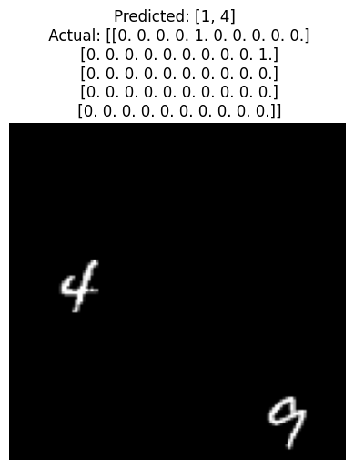

# Deep AutoEncoder using CNNs, MLPs, PCA
### by `Pratyush Jena`

## Dataset Preprocessing

- The dataset is present in `./data/interim/double_mnist`

- A load mnist data() that extracts images from the
dataset folders and organizes them into separate lists for images and labels
corresponding to the train, validation, and test splits
```python
def load_mnist_data(data_path):
    def load_images_from_folder(folder):
        images = []
        labels = []
        # Iterate through each subfolder, where the folder name itself represents the label sequence
        for label_folder in os.listdir(folder):
            label_path = os.path.join(folder, label_folder)
            if os.path.isdir(label_path):
                # Label is derived from each character in the folder name (e.g., '123' → [1, 2, 3])
                label = [int(digit) for digit in label_folder]
                if label == [0]: # Skip the label '0' as the image is empty
                    continue
                # Load all images in the subfolder
                for filename in os.listdir(label_path):
                    img_path = os.path.join(label_path, filename)
                    img = cv2.imread(img_path, cv2.IMREAD_GRAYSCALE)  # Load in grayscale
                    if img is not None:
                        images.append(img)
                        labels.append(label)  # Append list of digits as label
        return images, labels

    # Load data for train, val, and test splits
    train_images, train_labels = load_images_from_folder(os.path.join(data_path, 'train'))
    val_images, val_labels = load_images_from_folder(os.path.join(data_path, 'val'))
    test_images, test_labels = load_images_from_folder(os.path.join(data_path, 'test'))

    # Organize and return the data as a dictionary
    data = {
        'train': (train_images, train_labels),
        'val': (val_images, val_labels),
        'test': (test_images, test_labels)
    }
    return data

```

- MultiMNISTDataset that will be used to create
dataloaders for training and evaluation purposes. 

```python
class MultiMNISTDataset(Dataset):
    def __init__(self, images, labels, num_classes=10, max_seq_length=3):
        """
        Args:
            images (list of np.array): List of grayscale images (e.g., loaded using OpenCV).
            labels (list of lists): Each sublist contains integers representing the sequence of digits in the image.
            num_classes (int): Number of possible classes (digits), default is 10 for MNIST digits (0-9).
            max_seq_length (int): Fixed length for label sequences. Label sequences are padded/truncated to this length.
        """
        self.images = images
        self.labels = labels
        self.num_classes = num_classes
        self.max_seq_length = max_seq_length
        self.transform = transforms.ToTensor()  # Convert image to PyTorch tensor

    def __len__(self):
        return len(self.images)

    def __getitem__(self, idx):
        # Get image and convert it to tensor
        image = self.transform(self.images[idx])
        
        # Convert label list into one-hot encoded tensor with padding
        label_seq = self.labels[idx]
        label_tensor = torch.zeros(self.max_seq_length, self.num_classes)  # Padded one-hot tensor
        
        # Populate one-hot tensor up to max_seq_length
        for i, label in enumerate(label_seq[:self.max_seq_length]):  # Truncate if sequence is longer
            label_tensor[i, label] = 1.0  # Set one-hot for each digit in sequence

        return image, label_tensor
```
- example from the loader

```
tensor([[1., 0., 0., 0., 0., 0., 0., 0., 0., 0.],
        [0., 0., 0., 0., 0., 1., 0., 0., 0., 0.],
        [0., 0., 0., 0., 0., 0., 0., 0., 0., 0.]])

```


### 2.2 CNN Class

```python
class DigitCountCNN(nn.Module):
    def __init__(self, num_classes=4, task='classification'):
        """
        Initialize CNN model that can perform either classification or regression
        
        Args:
            num_classes (int): Number of classes for classification
            task (str): Either 'classification' or 'regression'
        """
        super(DigitCountCNN, self).__init__()
        self.task = task.lower()
        if self.task not in ['classification', 'regression']:
            raise ValueError("Task must be either 'classification' or 'regression'")
        
        # Convolutional layers (same for both tasks)
        self.conv1 = nn.Conv2d(1, 32, kernel_size=3, stride=1, padding=1)
        self.conv2 = nn.Conv2d(32, 64, kernel_size=3, stride=1, padding=1)
        self.conv3 = nn.Conv2d(64, 128, kernel_size=3, stride=1, padding=1)
        
        # Fully connected layers
        self.fc1 = nn.Linear(128 * 16 * 16, 256)
        
        # Output layer changes based on task
        if self.task == 'classification':
            self.fc2 = nn.Linear(256, num_classes)
        else:  # regression
            self.fc2 = nn.Linear(256, 1)  # Single continuous output
        
        self.dropout = nn.Dropout(0.5)

    def forward(self, x):
        x = F.relu(self.conv1(x))
        x = F.max_pool2d(x, 2)
        x = F.relu(self.conv2(x))
        x = F.max_pool2d(x, 2)
        x = F.relu(self.conv3(x))
        x = F.max_pool2d(x, 2)
        
        x = x.view(x.size(0), -1)
        x = F.relu(self.fc1(x))
        x = self.dropout(x)
        x = self.fc2(x)
        
        # Apply activation for classification (if needed)
        if self.task == 'classification':
            # Note: We don't apply softmax here because CrossEntropyLoss includes it
            return x
        else:
            # For regression, we might want to ensure non-negative outputs
            # depending on your specific use case
            return F.relu(x)  # or just return x if negative values are acceptable

```

### 2.3 Hyperparameter tuning

- cases
```python

{'learning_rate': 0.001, 'dropout_rate': 0.1,'optimizer': 'SGD'},
{'learning_rate': 0.01, 'dropout_rate': 0.3, 'optimizer': 'Adam'},
{'learning_rate': 0.05, 'dropout_rate': 0.5, 'optimizer': 'RMSprop'},
{'learning_rate': 0.01, 'dropout_rate': 0.0, 'optimizer': 'SGD'},
{'learning_rate': 0.001, 'dropout_rate': 0.5, 'optimizer': 'Adam'}

```
#### Classification
- 1


- 2


- 3


- 4


- 5
 

#### Regression

- 1


- 2


- 3


- 4


- 5


### 2.4 Feature map Visualization

- image 1


- image 2


- image 3


##  Multi Label Classification

### Data loading
```python
import os
from PIL import Image
from torch.utils.data import Dataset, DataLoader
import torchvision.transforms as transforms

def load_mnist_data(data_path):
    def load_images_from_folder(folder):
        images = []
        labels = []
        # Iterate through each subfolder, where the folder name itself represents the label sequence
        for label_folder in os.listdir(folder):
            label_path = os.path.join(folder, label_folder)
            if os.path.isdir(label_path):
                # Label is derived from each character in the folder name (e.g., '123' → [1, 2, 3])
                label = [int(digit) for digit in label_folder]
                if label == [0]: # Skip the label '0' as the image is empty
                    continue
                # Load all images in the subfolder
                for filename in os.listdir(label_path):
                    img_path = os.path.join(label_path, filename)
                    img = cv2.imread(img_path, cv2.IMREAD_GRAYSCALE)  # Load in grayscale
                    if img is not None:
                        images.append(img)
                        labels.append(label)  # Append list of digits as label
        return images, labels

    # Load data for train, val, and test splits
    train_images, train_labels = load_images_from_folder(os.path.join(data_path, 'train'))
    val_images, val_labels = load_images_from_folder(os.path.join(data_path, 'val'))
    test_images, test_labels = load_images_from_folder(os.path.join(data_path, 'test'))

    # Organize and return the data as a dictionary
    data = {
        'train': (train_images, train_labels),
        'val': (val_images, val_labels),
        'test': (test_images, test_labels)
    }
    return data

# Example usage
data_path = "../../data/interim/double_mnist"  # Replace with actual path
data = load_mnist_data(data_path)

print(f"Train: {len(data['train'][0])} images, {len(data['train'][1])} labels")
print(f"Val: {len(data['val'][0])} images, {len(data['val'][1])} labels")
print(f"Test: {len(data['test'][0])} images, {len(data['test'][1])} labels")
```

- reused the dataloader
```python
import torch
from torch.utils.data import Dataset, DataLoader
import torchvision.transforms as transforms
import matplotlib.pyplot as plt

class MultiMNISTDataset(Dataset):
    def __init__(self, images, labels, num_classes=10, max_seq_length=3):
        """
        Args:
            images (list of np.array): List of grayscale images (e.g., loaded using OpenCV).
            labels (list of lists): Each sublist contains integers representing the sequence of digits in the image.
            num_classes (int): Number of possible classes (digits), default is 10 for MNIST digits (0-9).
            max_seq_length (int): Fixed length for label sequences. Label sequences are padded/truncated to this length.
        """
        self.images = images
        self.labels = labels
        self.num_classes = num_classes
        self.max_seq_length = max_seq_length
        self.transform = transforms.ToTensor()  # Convert image to PyTorch tensor

    def __len__(self):
        return len(self.images)

    def __getitem__(self, idx):
        # Get image and convert it to tensor
        image = self.transform(self.images[idx])
        
        # Convert label list into one-hot encoded tensor with padding
        label_seq = self.labels[idx]
        label_tensor = torch.zeros(self.max_seq_length, self.num_classes)  # Padded one-hot tensor
        
        # Populate one-hot tensor up to max_seq_length
        for i, label in enumerate(label_seq[:self.max_seq_length]):  # Truncate if sequence is longer
            label_tensor[i, label] = 1.0  # Set one-hot for each digit in sequence

        return image, label_tensor

# Convert datasets into MultiMNISTDataset
train_images, train_labels = data['train']
print(f"Train: {len(train_images)} images, {len(train_labels)} labels")
train_dataset = MultiMNISTDataset(train_images, train_labels)

test_images, test_labels = data['test']
print(f"Test: {len(test_images)} images, {len(test_labels)} labels")
test_dataset = MultiMNISTDataset(test_images, test_labels)

val_images, val_labels = data['val']
print(f"Val: {len(val_images)} images, {len(val_labels)} labels")
val_dataset = MultiMNISTDataset(val_images, val_labels)

# Create DataLoaders for each dataset
train_loader = DataLoader(train_dataset, batch_size=32, shuffle=True)
test_loader = DataLoader(test_dataset, batch_size=32, shuffle=False)
val_loader = DataLoader(val_dataset, batch_size=32, shuffle=False)

# Checking a batch from train_loader
images, labels = next(iter(train_loader))
print(f"Batch of images shape: {images.shape}")
print(f"Batch of labels shape: {labels.shape}")

```
- one hot
```
tensor([[1., 0., 0., 0., 0., 0., 0., 0., 0., 0.],
        [0., 0., 0., 0., 0., 1., 0., 0., 0., 0.],
        [0., 0., 0., 0., 0., 0., 0., 0., 0., 0.]])
```


### MultiLabelCNN

```python
class MultiLabelCNNVariable(nn.Module):
    """
    CNN for multi-label digit classification that handles variable number of digits.
    Each image can contain up to 5 digits, with empty positions allowed.
    """
    
    def __init__(self, max_digits: int = 5, num_classes: int = 10):
        """
        Initialize the network.
        
        Args:
            max_digits: Maximum number of digit positions
            num_classes: Number of possible digits (0-9)
        """
        super(MultiLabelCNNVariable, self).__init__()
        
        self.max_digits = max_digits
        self.num_classes = num_classes
        
        # Feature extraction layers
        self.features = nn.Sequential(
            # First conv block
            nn.Conv2d(1, 32, kernel_size=3, padding=1),
            nn.BatchNorm2d(32),
            nn.ReLU(inplace=True),
            nn.Conv2d(32, 32, kernel_size=3, padding=1),
            nn.BatchNorm2d(32),
            nn.ReLU(inplace=True),
            nn.MaxPool2d(2),
            nn.Dropout2d(0.25),
            
            # Second conv block
            nn.Conv2d(32, 64, kernel_size=3, padding=1),
            nn.BatchNorm2d(64),
            nn.ReLU(inplace=True),
            nn.Conv2d(64, 64, kernel_size=3, padding=1),
            nn.BatchNorm2d(64),
            nn.ReLU(inplace=True),
            nn.MaxPool2d(2),
            nn.Dropout2d(0.25),
            
            # Third conv block
            nn.Conv2d(64, 128, kernel_size=3, padding=1),
            nn.BatchNorm2d(128),
            nn.ReLU(inplace=True),
            nn.Conv2d(128, 128, kernel_size=3, padding=1),
            nn.BatchNorm2d(128),
            nn.ReLU(inplace=True),
            nn.MaxPool2d(2),
            nn.Dropout2d(0.25)
        )
        
        self.global_pool = nn.AdaptiveAvgPool2d(1)
        
        # Shared fully connected layers
        self.fc_shared = nn.Sequential(
            nn.Linear(128, 256),
            nn.ReLU(inplace=True),
            nn.Dropout(0.5),
            nn.Linear(256, 256),
            nn.ReLU(inplace=True),
            nn.Dropout(0.5)
        )
        
        # Digit classifiers for each position
        self.digit_classifiers = nn.ModuleList([
            nn.Linear(256, num_classes) for _ in range(max_digits)
        ])
        
        # Presence detector for each position
        self.presence_detectors = nn.ModuleList([
            nn.Linear(256, 1) for _ in range(max_digits)
        ])
        
        self._initialize_weights()
    
    def _initialize_weights(self):
        """Initialize model weights using He initialization."""
        for m in self.modules():
            if isinstance(m, (nn.Conv2d, nn.Linear)):
                nn.init.kaiming_normal_(m.weight, mode='fan_out', nonlinearity='relu')
                if m.bias is not None:
                    nn.init.constant_(m.bias, 0)
            elif isinstance(m, nn.BatchNorm2d):
                nn.init.constant_(m.weight, 1)
                nn.init.constant_(m.bias, 0)

    def forward(self, x: torch.Tensor) -> tuple:
        """
        Forward pass of the network.
        
        Args:
            x: Input tensor of shape (batch_size, 1, height, width)
            
        Returns:
            tuple containing:
                - digit_preds: Tensor of shape (batch_size, max_digits, num_classes)
                - presence_preds: Tensor of shape (batch_size, max_digits)
        """
        # Extract features
        x = self.features(x)
        x = self.global_pool(x)
        x = x.view(x.size(0), -1)
        
        # Shared features
        shared_features = self.fc_shared(x)
        
        # Get digit predictions and presence predictions
        digit_preds = [classifier(shared_features) for classifier in self.digit_classifiers]
        presence_preds = [detector(shared_features) for detector in self.presence_detectors]
        
        # Stack predictions
        digit_preds = torch.stack(digit_preds, dim=1)  # (batch_size, max_digits, num_classes)
        presence_preds = torch.stack(presence_preds, dim=1)  # (batch_size, max_digits)
        presence_preds = torch.sigmoid(presence_preds.squeeze(-1))  # Convert to probabilities
        
        return digit_preds, presence_preds

```

### Results
- 
- 
- 
- 

**Answer:**

This model does **not require an additional activation function** after the last linear layer. Here's why:

1. **Difference Between This Model and a Simple Classifier**:
   - The previous CNN classifier likely performed **single-label classification**, where there was one output per input image (e.g., a single digit label). In such cases, a **softmax activation** might be applied to the output layer to convert logits into probabilities.
   - This model, however, performs **multi-label, multi-class classification**, predicting probabilities for multiple digit positions independently (e.g., predicting a digit at each of 5 positions). Each output "head" produces raw logits for 10 classes, and we use a **loss function that directly handles logits**.

2. **Why No Activation Function Is Needed?**
   - The model uses **CrossEntropyLoss** during training, which **combines softmax activation and negative log-likelihood loss in one step**. This means that applying a softmax function manually would be redundant and may cause numerical instability during training.

3. **Justification for Softmax (If Used)**:
   - If `CrossEntropyLoss` were not used, you would need to apply **softmax** to the output of each linear layer to transform the logits into probabilities. Softmax ensures that the output values for each digit position sum to 1, representing valid probability distributions.

---
- CrossEntropyLoss handles both softmax activation and loss computation.
- If softmax were applied manually, it would result in redundant computation and possible numerical instability.

### Hyper param tuning

```py
{"lr": 0.001, "dropout": 0.5, "optimizer": "Adam"},
{"lr": 0.0005, "dropout": 0.3, "optimizer": "Adam"},
{"lr": 0.001, "dropout": 0.4, "optimizer": "SGD"},
{"lr": 0.002, "dropout": 0.5, "optimizer": "Adam"},
{"lr": 0.0001, "dropout": 0.3, "optimizer": "RMSprop"},
```

```
Training with config: {'lr': 0.001, 'dropout': 0.5, 'optimizer': 'Adam'}
Epoch 1/10, Train Loss: 3.0632, Val Loss: 2.5462
Epoch 2/10, Train Loss: 2.5348, Val Loss: 2.5265
Epoch 3/10, Train Loss: 2.4816, Val Loss: 2.6482
Epoch 4/10, Train Loss: 2.4481, Val Loss: 2.9357
Epoch 5/10, Train Loss: 2.4237, Val Loss: 3.1064
Epoch 6/10, Train Loss: 2.3985, Val Loss: 3.5509
Epoch 7/10, Train Loss: 2.3822, Val Loss: 2.8024
Epoch 8/10, Train Loss: 2.3660, Val Loss: 2.9124
Epoch 9/10, Train Loss: 2.3581, Val Loss: 3.0717
Epoch 10/10, Train Loss: 2.3434, Val Loss: 2.7399

Training with config: {'lr': 0.0005, 'dropout': 0.3, 'optimizer': 'Adam'}
Epoch 1/10, Train Loss: 2.6310, Val Loss: 2.5882
Epoch 2/10, Train Loss: 2.3801, Val Loss: 2.8582
Epoch 3/10, Train Loss: 2.3370, Val Loss: 3.0693
Epoch 4/10, Train Loss: 2.2962, Val Loss: 2.6985
Epoch 5/10, Train Loss: 2.1982, Val Loss: 2.7487
Epoch 6/10, Train Loss: 2.1190, Val Loss: 2.8670
Epoch 7/10, Train Loss: 2.0629, Val Loss: 2.8715
Epoch 8/10, Train Loss: 2.0072, Val Loss: 3.3370
Epoch 9/10, Train Loss: 1.9156, Val Loss: 3.2410
Epoch 10/10, Train Loss: 1.8454, Val Loss: 2.7210

Training with config: {'lr': 0.001, 'dropout': 0.4, 'optimizer': 'SGD'}
Epoch 1/10, Train Loss: 2.8254, Val Loss: 2.5662
Epoch 2/10, Train Loss: 2.4456, Val Loss: 3.0225
Epoch 3/10, Train Loss: 2.4010, Val Loss: 3.2136
Epoch 4/10, Train Loss: 2.3711, Val Loss: 3.1519
Epoch 5/10, Train Loss: 2.3523, Val Loss: 3.1463
Epoch 6/10, Train Loss: 2.3342, Val Loss: 2.8528
Epoch 7/10, Train Loss: 2.3213, Val Loss: 2.9851
Epoch 8/10, Train Loss: 2.3028, Val Loss: 2.8733
Epoch 9/10, Train Loss: 2.2693, Val Loss: 2.8395
Epoch 10/10, Train Loss: 2.2180, Val Loss: 2.4360

Training with config: {'lr': 0.002, 'dropout': 0.5, 'optimizer': 'Adam'}
Epoch 1/10, Train Loss: 3.0384, Val Loss: 2.5324
Epoch 2/10, Train Loss: 2.5217, Val Loss: 2.5023
Epoch 3/10, Train Loss: 2.4735, Val Loss: 2.8616
Epoch 4/10, Train Loss: 2.4440, Val Loss: 2.7178
Epoch 5/10, Train Loss: 2.4178, Val Loss: 3.0353
Epoch 6/10, Train Loss: 2.3988, Val Loss: 2.9317
Epoch 7/10, Train Loss: 2.3843, Val Loss: 2.9532
Epoch 8/10, Train Loss: 2.3651, Val Loss: 3.0188
Epoch 9/10, Train Loss: 2.3524, Val Loss: 2.8712
Epoch 10/10, Train Loss: 2.3463, Val Loss: 3.1719

Training with config: {'lr': 0.0001, 'dropout': 0.3, 'optimizer': 'RMSprop'}
Epoch 1/10, Train Loss: 2.6418, Val Loss: 2.6190
Epoch 2/10, Train Loss: 2.3801, Val Loss: 2.9652
Epoch 3/10, Train Loss: 2.3364, Val Loss: 3.3799
Epoch 4/10, Train Loss: 2.3141, Val Loss: 3.2742
Epoch 5/10, Train Loss: 2.2809, Val Loss: 2.9306
Epoch 6/10, Train Loss: 2.2012, Val Loss: 3.1817
Epoch 7/10, Train Loss: 2.1391, Val Loss: 3.1067
Epoch 8/10, Train Loss: 2.0894, Val Loss: 4.6940
Epoch 9/10, Train Loss: 2.0424, Val Loss: 6.7323
Epoch 10/10, Train Loss: 2.0126, Val Loss: 22.3797

```

#### plots
1. 
2. 
3. 
4. 
5. 

best = `{"lr": 0.001, "dropout": 0.5, "optimizer": "Adam"}`

#### Results from best
```
Exact Match Accuracy (Train): 0.0004
Hamming Accuracy (Train): 0.0855
Exact Match Accuracy (Validation): 0.0000
Hamming Accuracy (Validation): 0.0614
Exact Match Accuracy (Test): 0.0000
Hamming Accuracy (Test): 0.0256
```

## Auto-Encoder

Loading the Data fashion-mnist

```py
# shuffle data
np.random.seed(42)
idx = np.random.permutation(len(pixels))
pixels = pixels.iloc[idx]
labels = labels.iloc[idx]

# test train val 20 70 10
X_train = pixels.iloc[:int(0.7*len(pixels))]
y_train = labels.iloc[:int(0.7*len(pixels))]
X_test = pixels.iloc[int(0.7*len(pixels)):int(0.9*len(pixels))]
y_test = labels.iloc[int(0.7*len(pixels)):int(0.9*len(pixels))]
X_val = pixels.iloc[int(0.9*len(pixels)):]
y_val = labels.iloc[int(0.9*len(pixels)):]

# reshape to 28x28
X_train = X_train.values.reshape(-1, 1, 28, 28)
X_test = X_test.values.reshape(-1, 1, 28, 28)
X_val = X_val.values.reshape(-1, 1, 28, 28)
```

Loading the fashion-dataset


### CnnAutoencoder class

```py
class CnnAutoencoder(nn.Module):
    def __init__(self):
        super(CnnAutoencoder, self).__init__()
        
        # Encoder
        self.encoder = nn.Sequential(
            # Input: 1x28x28
            nn.Conv2d(1, 16, kernel_size=3, stride=1, padding=1),  # 16x28x28
            nn.ReLU(),
            nn.MaxPool2d(2, 2),  # 16x14x14
            
            nn.Conv2d(16, 8, kernel_size=3, stride=1, padding=1),  # 8x14x14
            nn.ReLU(),
            nn.MaxPool2d(2, 2),  # 8x7x7
            
            nn.Conv2d(8, 4, kernel_size=3, stride=1, padding=1),  # 4x7x7
            nn.ReLU()
        )
        
        # Decoder
        self.decoder = nn.Sequential(
            # Input: 4x7x7
            nn.ConvTranspose2d(4, 8, kernel_size=3, stride=2, padding=1, output_padding=1),  # 8x14x14
            nn.ReLU(),
            
            nn.ConvTranspose2d(8, 16, kernel_size=3, stride=2, padding=1, output_padding=1),  # 16x28x28
            nn.ReLU(),
            
            nn.Conv2d(16, 1, kernel_size=3, stride=1, padding=1),  # 1x28x28
            nn.Sigmoid()  # Output values between 0 and 1 since input is normalized
        )
    
    def encode(self, x):
        """
        Reduces the spatial dimensions of the input image
        Args:
            x: Input tensor of shape [batch_size, 1, 28, 28]
        Returns:
            Encoded representation of shape [batch_size, 4, 7, 7]
        """
        return self.encoder(x)
    
    def decode(self, z):
        """
        Reconstructs the image from the latent space representation
        Args:
            z: Latent space tensor of shape [batch_size, 4, 7, 7]
        Returns:
            Reconstructed image of shape [batch_size, 1, 28, 28]
        """
        return self.decoder(z)
    
    def forward(self, x):
        """
        Forward pass through the autoencoder
        Args:
            x: Input tensor of shape [batch_size, 1, 28, 28]
        Returns:
            Reconstructed image of shape [batch_size, 1, 28, 28]
        """
        z = self.encode(x)
        return self.decode(z)
```

### training

- 1-5 epoch


- 6-10 epoch


- 11-15 epoch


- 16-20


- val and train loss


- final


saved as
`cnn_autoencoder_fashion_mnist_0.pth`

#### Comaparision


#### Analyzing Latent Space


#### Cluster separation


### HyperParam tuning

```py
{
        'name': 'Base Config',
        'kernel_size': 3,
        'n_filters': [16, 8, 4],
        'learning_rate': 0.001,
        'optimizer': 'adam'
    },
    {
        'name': 'Large Kernels',
        'kernel_size': 5,
        'n_filters': [32, 16, 8],
        'learning_rate': 0.001,
        'optimizer': 'adam'
    },
    {
        'name': 'SGD + High LR',
        'kernel_size': 3,
        'n_filters': [16, 8, 4],
        'learning_rate': 0.01,
        'optimizer': 'sgd'
    }
```


#### different layers

```py
{'name': '2 Layers', 'n_layers': 2, 'n_filters': [16, 8]},
{'name': '3 Layers', 'n_layers': 3, 'n_filters': [16, 8, 4]},
```


### MLP autoencoder

#### Training


#### Comparing results 


```
Final Test Losses:
CNN Autoencoder: 0.007095
MLP Autoencoder: 0.014840
```

- MLP test loss = `0.014839785488713115`

### PCA autoencoder

#### class

```py
class PcaAutoencoder:
    def __init__(self, n_components):
        self.n_components = n_components  # Number of principal components
        self.mean = None  # Mean of the data for centering
        self.eigenvectors = None  # Eigenvectors for the transformation
    
    def fit(self, X):
        """
        Fits the PCA model by calculating eigenvalues and eigenvectors.
        """
        # Step 1: Center the data by subtracting the mean
        self.mean = np.mean(X, axis=0)
        X_centered = X - self.mean

        # Step 2: Compute the covariance matrix
        covariance_matrix = np.cov(X_centered, rowvar=False)

        # Step 3: Compute eigenvalues and eigenvectors
        eigenvalues, eigenvectors = np.linalg.eigh(covariance_matrix)

        # Step 4: Sort eigenvectors by descending eigenvalues
        sorted_indices = np.argsort(eigenvalues)[::-1]
        self.eigenvectors = eigenvectors[:, sorted_indices[:self.n_components]]

    def encode(self, X):
        """
        Reduces the dimensionality of the input data using learned eigenvectors.
        """
        # Center the data
        X_centered = X - self.mean
        # Project onto the top principal components
        return np.dot(X_centered, self.eigenvectors)

    def forward(self, X):
        """
        Reconstructs the data from the reduced representation.
        """
        # Encode the data (reduce dimensionality)
        Z = self.encode(X)
        mean = np.mean(X, axis=0)
        # convert mean to 2D array
        mean = np.array([mean])
        # Reconstruct the data by projecting back to the original space
        X_reconstructed = np.dot(Z, self.eigenvectors.T) + mean
        return X_reconstructed

```

#### MSE vs number of components


best use component from elbow plot = `32`
#### Results


### KNN classification

#### Running on KNN raw

```
Accuracy: 0.8064
Macro Precision: 0.8095
micro Precision: 0.8064
Macro Recall: 0.8061
Micro Recall: 0.8064
Macro F1 Score: 0.8042
Micro F1 Score: 0.8064
Specificity: 0.9785
```

#### After extracting latent representation from CNN
- val
```
Accuracy: 0.1020
Macro Precision: 0.1026
micro Precision: 0.1020
Macro Recall: 0.1019
Micro Recall: 0.1020
Macro F1 Score: 0.0999
Micro F1 Score: 0.1020
Specificity: 0.9002
```
- test
```
Accuracy: 0.0967
Macro Precision: 0.0966
micro Precision: 0.0967
Macro Recall: 0.0963
Micro Recall: 0.0967
Macro F1 Score: 0.0951
Micro F1 Score: 0.0967
Specificity: 0.8996
```
- confusion matrix


#### After extracting latent representatoin from PCA
- val
```
Accuracy: 0.8406
Macro Precision: 0.8406
micro Precision: 0.8406
Macro Recall: 0.8403
Micro Recall: 0.8406
Macro F1 Score: 0.8393
Micro F1 Score: 0.8406
Specificity: 0.9823
```
- test
```
Accuracy: 0.8418
Macro Precision: 0.8411
micro Precision: 0.8418
Macro Recall: 0.8411
Micro Recall: 0.8418
Macro F1 Score: 0.8402
Micro F1 Score: 0.8418
Specificity: 0.9824
```
- confusion matrix


#### After extracting latent representatoin from MLP auto encoder
- val
```
Accuracy: 0.7590
Macro Precision: 0.7595
micro Precision: 0.7590
Macro Recall: 0.7596
Micro Recall: 0.7590
Macro F1 Score: 0.7581
Micro F1 Score: 0.7590
Specificity: 0.9732
```
- test
```
Accuracy: 0.7578
Macro Precision: 0.7561
micro Precision: 0.7578
Macro Recall: 0.7563
Micro Recall: 0.7578
Macro F1 Score: 0.7552
Micro F1 Score: 0.7578
Specificity: 0.9731
```
- confusion matrix


